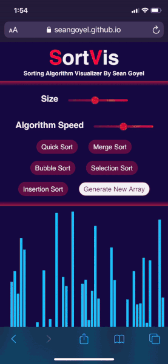

# 
## Sorting Algorithm Visualizer

A passion project I have created fuelled by my passion for sorting algorithms. This project offers the ability to watch an algorithm at a fraction of its speed to learn about the fascinating operations taking place or it can be sped up to see the power of sorting algorithms.

### Functionality:
- Quick sort
- Merge sort
- Selection sort
- Insertion sort
- Bubble sort
- Visualizes algorithms in a comprehensible manner
- Coded using the separation of concerns design principle

 

